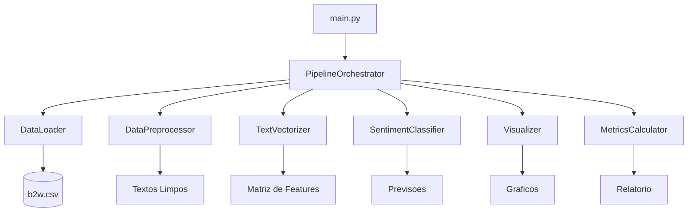

# 📊 Análise de Sentimentos - B2W


> **Pós-Graduação em Inteligência Artificial para Desenvolvedores**  
> **FIAP** — Disciplina: Processamento de Linguagem Natural (PLN)  
> **Autor:** Marco Antonio Teixeira

---

## 📖 Sobre o Projeto

Este projeto implementa um **classificador de sentimentos** para avaliações de produtos da **B2W** (Americanas, Submarino, Shoptime), utilizando técnicas de **Processamento de Linguagem Natural (PLN)** e **Machine Learning**.

O sistema analisa textos de reviews e classifica automaticamente o sentimento como:
- ✅ **Positivo (1)** — Cliente satisfeito
- ❌ **Negativo (0)** — Cliente insatisfeito

### 🎯 Objetivos

- Implementar um pipeline completo de NLP seguindo boas práticas de engenharia de software
- Aplicar princípios **SOLID** na arquitetura do código
- Utilizar **Bag of Words** (CountVectorizer) para vetorização de texto
- Treinar um modelo de **Regressão Logística** para classificação binária
- Gerar visualizações para análise exploratória dos dados
- Criar um projeto profissional e reutilizável como portfólio

## Arquitetura do Projeto




### Fluxo do Pipeline

sequenceDiagram
    participant M as main.py
    participant O as Orchestrator
    participant L as DataLoader
    participant P as Preprocessor
    participant V as Vectorizer
    participant MD as Model
    participant E as Evaluator
    participant VIS as Visualizer

    M->>O: executar()
    O->>L: carregar()
    L-->>O: DataFrame bruto
    O->>P: processar(df)
    P-->>O: DataFrame limpo
    O->>V: fit_transform(textos)
    V-->>O: Matriz esparsa (BoW)
    O->>MD: treinar(X_train, y_train)
    MD-->>O: Modelo treinado
    O->>MD: prever(X_test)
    MD-->>O: Predições
    O->>E: acuracia(), matriz_confusao()
    E-->>O: Métricas
    O->>VIS: nuvem_palavras(), matriz_confusao()
    VIS-->>O: Gráficos salvos
    O-->>M: Resultados


## Estrutura de Diretorios

    analise_sentimentos/
    │
    ├── README.md
    ├── .gitignore
    ├── requirements.txt
    ├── Makefile
    ├── main.py
    │
    ├── config/
    │   └── config.yaml
    │
    ├── data/
    │   └── raw/
    │       └── b2w.csv
    │
    ├── src/
    │   ├── data/
    │   │   ├── loader.py
    │   │   └── preprocessor.py
    │   │
    │   ├── features/
    │   │   └── vectorizer.py
    │   │
    │   ├── models/
    │   │   ├── base_model.py
    │   │   └── sentiment_classifier.py
    │   │
    │   ├── evaluation/
    │   │   ├── metrics.py
    │   │   └── visualizer.py
    │   │
    │   └── pipeline/
    │       └── orchestrator.py
    │
    ├── notebooks/
    │   └── 01_analise_exploratoria.ipynb
    │
    ├── outputs/
    │   ├── figures/
    │   └── models/
    │
    └── tests/
        ├── test_preprocessor.py
        └── test_models.py


🚀 Como Executar
Pré-requisitos
Python 3.10+
Git
pip (gerenciador de pacotes Python)

## Instalacao

### 1. Clonar o repositorio

```bash
git clone https://github.com/MAntonioST/analise-sentimentos-b2w.git
cd analise-sentimentos-b2w
```

### 2. Criar ambiente virtual

```bash
python -m venv venv
```

### 3. Ativar o ambiente virtual

**Linux / macOS:**

```bash
source venv/bin/activate
```

**Windows:**

```bash
venv\Scripts\activate
```

### 4. Instalar dependencias

```bash
pip install --upgrade pip
pip install -r requirements.txt
```

### 5. Adicionar o dataset

Coloque o arquivo `b2w.csv` na pasta `data/raw/`.


📊 Resultados Esperados
Após a execução, o projeto gera:

📈 Métricas do Modelo

Acurácia: ~85%

Relatório de Classificação:
              precision    recall  f1-score   support

Negativo (0)       0.85      0.84      0.85       500
Positivo (1)       0.86      0.87      0.86       500

    accuracy                           0.85      1000
   macro avg       0.85      0.85      0.85      1000
weighted avg       0.85      0.85      0.85      1000

### Visualizações Geradas
| Gráfico | Descrição | Localização |
| --- | --- | --- |
| Nuvem de Palavras (Geral) | Palavras mais frequentes em todas as avaliações | outputs/figures/wordcloud_todas.png |
| Nuvem de Palavras (Positivas) | Palavras características de avaliações positivas | outputs/figures/wordcloud_positivas.png |
| Nuvem de Palavras (Negativas) | Palavras características de avaliações negativas | outputs/figures/wordcloud_negativas.png |
| Matriz de Confusão | Heatmap mostrando acertos e erros do modelo | outputs/figures/matriz_confusao.png |
| Distribuição de Classes | Gráfico de barras com balanceamento do dataset | outputs/figures/distribuicao_classes.png |

## Modelos Salvos

- `sentiment_model.joblib` — Modelo de Regressao Logistica treinado
- `vectorizer.joblib` — Vetorizador CountVectorizer ajustado

---

## Tecnologias Utilizadas

### Linguagem e Frameworks

- **Python 3.9+** — Linguagem principal
- **Scikit-learn** — Modelos de Machine Learning
- **Pandas** — Manipulacao de dados
- **NLTK** — Processamento de linguagem natural
- **Matplotlib / Seaborn** — Visualizacao de dados
- **Joblib** — Persistencia dos modelos


| Tecnologia | Versão | Uso |
| --- | --- | --- |
| Python | 3.10+ | Linguagem principal |
| pandas | 2.2.0 | Manipulação e análise de dados |
| numpy | 1.26.3 | Computação numérica |
| scikit-learn | 1.4.0 | Machine Learning e métricas |
| matplotlib | 3.8.2 | Visualizações estáticas |
| seaborn | 0.13.1 | Visualizações estatísticas |
| wordcloud | 1.9.3 | Nuvens de palavras |
| PyYAML | 6.0.1 | Configurações em YAML |
| joblib | 1.3.2 | Serialização de modelos |


## Ferramentas de Desenvolvimento

- **Git** — Controle de versão
- **VS Code** — IDE
- **Jupyter Notebook** — Analise exploratoria
- **Make** — Automacao de comandos

---

## Testes

Para executar os testes unitarios:

```bash
python -m pytest tests/ -v
```


---

## 📚 Conceitos Aplicados

### Processamento de Linguagem Natural (PLN)

| Conceito | Descrição |
|----------|-----------|
| **Tokenização** | Divisão do texto em palavras (tokens) |
| **Vetorização** | Conversão de texto em representação numérica |
| **Bag of Words** | Modelo que conta frequência de palavras |
| **CountVectorizer** | Implementação do sklearn para BoW |

### Machine Learning

| Conceito | Descrição |
|----------|-----------|
| **Classificação Binária** | Duas classes: positivo (1) e negativo (0) |
| **Regressão Logística** | Modelo linear para classificação probabilística |
| **Train/Test Split** | Divisão dos dados em treino (80%) e teste (20%) |
| **Stratification** | Manter proporção das classes em ambas as partições |
| **Métricas** | Acurácia, Precisão, Recall, F1-Score |

### Engenharia de Software

| Conceito | Descrição |
|----------|-----------|
| **SOLID** | Princípios de design orientado a objetos |
| **Arquitetura Modular** | Separação de responsabilidades por contexto |
| **Pipeline de Dados** | Fluxo organizado: carga → limpeza → vetorização → modelo |
| **Configuração YAML** | Parâmetros centralizados em `config/config.yaml` |
| **Git** | Versionamento de código |
| **Type Hints** | Documentação de tipos para melhor legibilidade |

---


## Contribuicao

Contribuicoes sao bem-vindas! Siga os passos abaixo:

1. Faca um **fork** do projeto
2. Crie uma branch para sua feature:
   ```bash
   git checkout -b feature/AmazingFeature
   ```
3. Commit suas mudancas:
   ```bash
   git commit -m 'Add some AmazingFeature'
   ```
4. Push para a branch:
   ```bash
   git push origin feature/AmazingFeature
   ```
5. Abra um **Pull Request**


---

## Licenca

Este projeto esta licenciado sob a [MIT License](LICENSE).

Copyright (c) 2026 Marco Antonio Teixeira


---

## Autor

**Marco Antonio Teixeira**  
Ano: 2026

---

## Contato

- **GitHub:** [github.com/MAntonioST](https://github.com/MAntonioST)
- **Email:** [m.antonyteixeira@gmail.com](mailto:m.antonyteixeira@gmail.com)

---

## Referencias

- [scikit-learn Documentation](https://scikit-learn.org/stable/)
- [Pandas Documentation](https://pandas.pydata.org/docs/)
- [NLTK Book](https://www.nltk.org/book/)
- [Bag of Words Model](https://en.wikipedia.org/wiki/Bag-of-words_model)
- [Logistic Regression](https://en.wikipedia.org/wiki/Logistic_regression)

---

